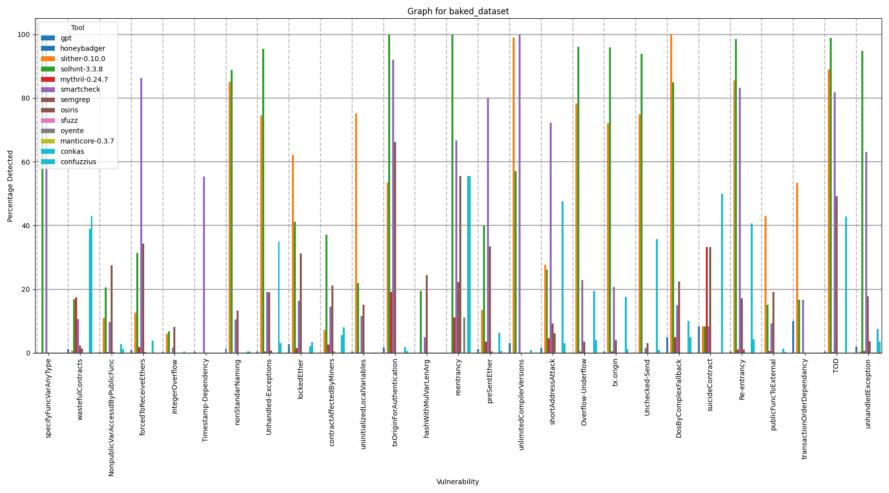

 

# Experiment

In this document we present an overview of the preliminary results we obtained by running Vullab in a large set of smart contracts. This serves as proof of our tool's applicability in reliably constructing a benchmark-capable large dataset and readily using it for comparing state-of-the-art Solidity analysis tools. **Please note that we undertook this execution in a prior version of our tool**, still during its development. Most differences from the current one only regard technical aspects, configuration options and the user interface, which shouldn't affect the core functionalities. However, the vulnerabilities were not yet standardized to SCWE and our subsequent extension, hence the results plot retains the bug names given by the respective insertion tool that created them.

## Table of contents
- [Experiment](#experiment)
  - [Table of contents](#table-of-contents)
  - [Introduction](#introduction)
  - [Database Construction](#database-construction)
  - [VulLab Execution](#vullab-execution)
  - [Results](#results)
  - [References](#references)

## Introduction

VulLab is part of a work-in-progress research project regarding surveying the current state-of-the-art in vulnerability detection capabilities in Solidity smart contracts and proposing a validation framework for systematically validating newly developed bug analysis applications. Currently, Vullab is under consideration for publishing as a standalone tool in SBseg's (Simpósio Brasileiro de Segurança) Tools Workshop, a conference in Brazil where researchers can publish complete works, works-in-progress and practical solutions regarding various cybersecurity areas.

## Database Construction

For the construction of the database which would be automatically inserted and labelled, we compiled several smart contracts sourced from other works which, in turn, collected them directly from the Ethereum mainnet. Namely, we included [DISL](https://huggingface.co/datasets/ASSERT-KTH/DISL)[[1](#references)], [Smart Contract Sanctuary](https://github.com/tintinweb/smart-contract-sanctuary)'s Solidity source code contracts, and [HuangGai](https://github.com/xf97/HuangGai)'s unlabeled datasets. We ended up with a collection of over 300,000 unique `.sol` files. Due to the insertion processes intensive computational requirements, even with multi-threading, and the preliminary nature of this execution, we decided to further reduce its size by considering only the first sixth os the contracts sorted in alphabetical order. The end result were approximately 50,000 entries.

## VulLab Execution

We executed both bug injection tools supported by Vullab, `SolidiFI` and `HuangGai`, with 20 threads and a 1 second (approximately 0.017 minutes) timeout for HuangGai's containers. The complete injection process took approximately 18 days to complete and resulted in dozens of thousands of inserted contracts. Noticeably, the number of contracts that were inserted varies depending on the vulnerability, with some of them containing several thousands and others resulting in just a few hundred entries.

We then executed VulLab's analysis module, comprised of `SmartBugs` with all of the 14 tools that support bug detection in Solidity source code. For this step, we configured our tool to consider only the 1000 contracts from each inserted bug in our dataset which presented the most complex code, which it measures by counting the number of functional lines. GPT was also included, but its configuration further decreased the number of analyzed contracts to only 100 per vulnerability due to cost constrains. The model selected was `gpt-4o-mini`.

The strategy of filtering only the most complex smart contracts for the analysis is in-line with the observations made in `Slither`'s paper[[2](#references)], in which the researchers point out that most contracts deployed to the Ethereum mainnet were simple scrips, most likely just for tests. Such plain scripts are not representative of real-life applications, thus unsuitable for benchmarking vulnerability detection tools.

## Results

The end results were build using a match window of 1 line, and were compiled in the following plot:

  

## References

[1] Morello, G., Eshghie, M., Bobadilla, S., and Monperrus, M. (2024). Disl: Fueling research with a large dataset of solidity smart contracts. DOI: https://arxiv.org/abs/2403.16861

[2] Feist, J., Grieco, G., and Groce, A. (2019). Slither: A static analysis framework for smart
contracts. In 2019 IEEE/ACM 2nd International Workshop on Emerging Trends in
Software Engineering for Blockchain (WETSEB), pages 8–15. DOI: https://doi.org/10.1109/WETSEB.2019.00008

