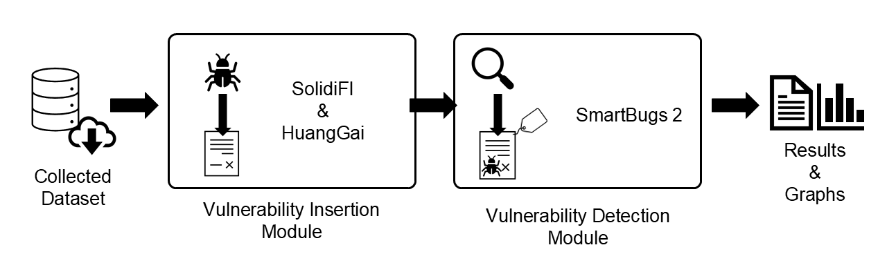
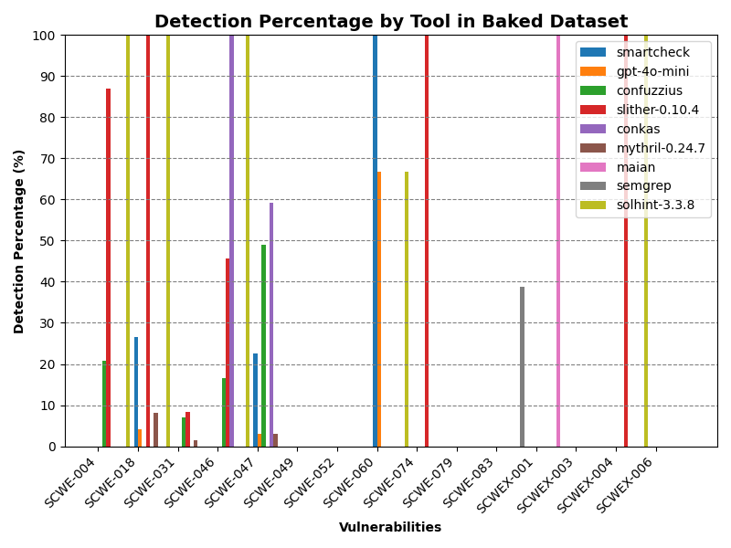
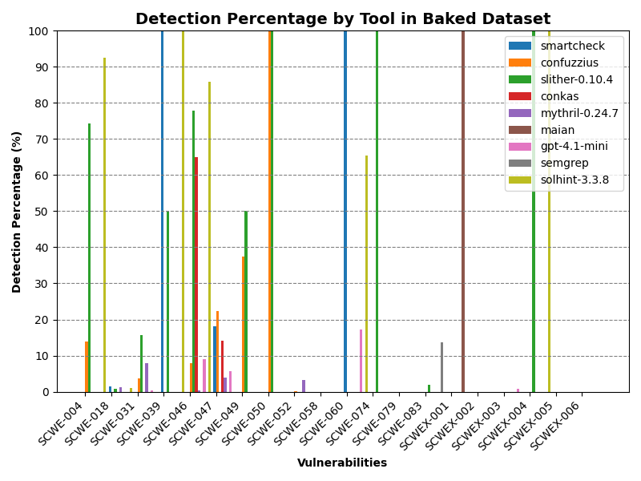

<div style="text-align: justify"> 

# VulLab

This repository is related to the paper "*Building a Labeled Smart Contract Dataset for Evaluating Vulnerability Detection Tools’ Effectiveness*", currently under evaluation for publishing in SBSeg2025's Tools Session. The work's abstract goes as follows:

*In recent years, surveys on vulnerability detection tools for Solidity-based smart contracts have shown that many of them display poor capabilities. One of the causes for such deficiencies is the absence of good-quality bench-marking datasets where bugs typically found in smart contracts are accurately labeled. To help tackle this issue, we propose VulLab, a framework incorporating state-of-the-art tools that efficiently insert vulnerabilities in collected contracts. In addition, it also facilitates the execution of several analysis tools against the generated dataset, compiling the results graphically for easy inspection. By improving automation, the proposed solution should become a powerful ally for smart contract developers and auditors, contributing to the security of programmable blockchain platforms. VulLab is open-source and is available https://github.com/7e095ac7d0/vullab.*

## Table of contents
- [VulLab](#vullab)
  - [Table of contents](#table-of-contents)
  - [Introduction](#introduction)
  - [Pre-requisites](#pre-requisites)
  - [Installation](#installation)
    - [Using Miniconda (recommended)](#using-miniconda-recommended)
    - [Using pip (not recommended)](#using-pip-not-recommended)
  - [Usage](#usage)
    - [Command line interface](#command-line-interface)
    - [Options](#options)
  - [Test Datasets](#test-datasets)
    - [Smoke test](#smoke-test)
    - [Complete test](#complete-test)
  - [Demo (In portuguese)](#demo-in-portuguese)

## Introduction
VulLab is a vulnerability detection tools validation framework specialized in Solidity-based smart contracts that combines three important state-of-the-art works. Its implementation brings together bug insertion capabilities with the automatic execution of detection techniques. By providing means to seamlessly obtain a benchmark capable dataset of labeled contracts from any sizable collection of smart contracts we hope to help developers to more easily test their newly developed analysis solutions with previously presented detection tools. 

For the addition of bugs to collected smart contracts, this tool is powered by two of the foremost insertion applications for Solidity source code: [SolidiFI](https://github.com/DependableSystemsLab/SolidiFI) and [HuangGai](https://github.com/xf97/HuangGai). The supported versions for them are `pragma version 0.5.0^` and `pragma version 0.7.0^` respectively. VulLab enhances these tools' usability by executing them in a seamless automatic multi-threading mode. Besides, the inserted contracts and labels are standardized to SolidiFI's robust CSV format and directly matched with the [Smart Contract Vulnerability Weakness Enumeration (SCWE)](https://scs.owasp.org/SCWE/) entry deemed closest to each of them. In the cases were no SCWE match was deemed reasonable, we defined our own extension to the enumeration, named SCWEX. The integration of insertion mechanisms was specifically designed with modularity in mind, enabling an easy way to add new tools to this framework as they are developed.

As for the the execution of vulnerability analysis tools, it employs [SmartBugs](https://github.com/smartbugs/smartbugs), which enables for the parallelization of containerized tools. Its modularity makes it a perfect choice for VulLab as it can be easily extended by following [the extension tutorial](https://github.com/smartbugs/smartbugs/wiki/Adding-new-analysis-tools) in its [wiki](https://github.com/smartbugs/smartbugs/wiki) page, thus enabling developers to add their newly developed tool to effortlessly obtain a comparison with other stat-of-the-art analyzers. The results obtained by running the analysis are automatically compiled into `results/summary.csv`, which is used for comparison with the vulnerability labels, thus generating a graph.

The image bellow offers an overview of the process described in this section:

<p align="center">
  
</p>

An in-depth explanation of Vullab's implementation can be found in the [Technical Details page](docs/Technical_Details.md). You can read about a use case we undertook in the [Experiment page](docs/Experiment.md). 

## Pre-requisites
VulLab was made for Linux systems and was not tested in Windows or MacOS. Its main dependencies are `Docker` and `Python`.

For installing `Docker` follow [Docker's installation tutorial](https://docs.docker.com/engine/install/ubuntu/). Make sure to add your user to the `Docker` group to allow VulLab to use it. You can achieve that by executing 

```
sudo usermod -a -G docker $USER
```

Please refer to `Docker`'s [documentation](https://docs.docker.com/manuals/) for more information.

We recommend using `python version 3.13`. Make sure you have this version installed or get it by typing

```
apt-get install python3.13
```

`SmartBugs` is also needed to execute the analysis of smart contracts by vulnerability detection tools. Note that Smartbugs should be installed **after** cloning vullab's repository. To install the tool, clone its source into VulLab's directory by executing

```
git clone https://github.com/smartbugs/smartbugs
```

Then, install the provided virtual environment by typing

```
cd smartbugs
install/setup-venv.sh
```

For more information on `SmartBugs` installation please refer to its [installation tutorial](https://github.com/smartbugs/smartbugs/blob/master/doc/installation.md). The repository's [wiki](https://github.com/smartbugs/smartbugs/wiki) page also offers helpful information regarding the tool's installation, usage and extension.

## Installation
We offer two installation alternatives: one requiring `miniconda`, a free environment managing tool, and another which only requires a system with `python`.

For either choice, the first step is to clone this repository. To achieve that execute the following line in the directory you wish VulLab to be located

```
git clone https://github.com/7e095ac7d0/vullab.git
```

Then enter VulLab's working directory by executing

```
cd vullab
```

### Using Miniconda (recommended)
This alternative utilizes the provided environment provided in file `vullab_env.yml`. Its usage requires `miniconda`, which can be obtained by following [miniconda's installation tutorial](https://www.anaconda.com/docs/getting-started/miniconda/install). Once `miniconda` is installed, import the provided environment by executing

```
conda env create --file vullab_env.yml
```

To access the newly created enviornment just type

```
conda activate vullab
```

### Using pip (not recommended)
Alternatively you can install all the requirements manually in a virtual environment of your choice or in your main system. Before choosing this option we invite you to reconsider using `miniconda` as it enables you to use the provided specifically configured environment for VulLab, thus reducing the possibility of any issues.

First, make sure `pip` is installed by executing

```
python -m ensurepip --upgrade
```

Then, install VulLab's dependencies in your environment by typing

```
pip install -r requirements.txt
```

## Usage

VulLab can be utilized using the command line interface developed. It enables an easy way to execute each of the included tools, either independently or with one another, with the desired configuration.

### Command line interface
```
vullab.sh [--threads THREADS] [--cpus CPUS]
          [--solidifi] [--huanggai TIMEOUT]
          [--analyze QUANTITY] [--gpt QUANTITY MODEL] 
          [--match-window MATCH_WINDOW] [--build] 
          [--help]
```

### Options
`--threads THREADS`, `-t THREADS` Configures how many threads will run simultaneously during insertion and detection phases of the execution. Set as 1 by default, which means sequential execution.

`--cpus CPUS`, `-c CPUS` Configures how many CPUs will be assigned to each process. As each thread runs as a container, this setting means how many cpu power each container will receive. Set as 1 by default.

`--solidifi`, `-s` Executes SolidiFi in all of the `.sol` files located in `\dataset\raw_dataset`. The tool will insert as many vulnerabilities as it can in all of the contracts it finds suitable. The inserted contracts will be located at `\dataset\baked_dataset\*\smart_contracts` and the labels will be located in `\dataset\baked_dataset\*\labels`, where `*` represents a directory with the name of each supported vulnerability.

`--huanggai TIMEOUT`, `-u TIMEOUT` Executes HuangGai in all of the `.sol` files located in `\dataset\raw_dataset`. The inserted contracts will be located at `\dataset\baked_dataset\*\smart_contracts` and the labels will be located in `\dataset\baked_dataset\*\labels`, where `*` represents a directory with the name of each supported vulnerability. The optional configuration TIMEOUT corresponds to the timeout of each HuangGai container, which is set as 0.5 minutes by default.

`--analyze QUANTITY`, `-a QUANTITY` Executes `SmartBugs` in all of the contracts located in `\dataset\baked_dataset\*\smart_contracts`. Note that, despite supporting several other detection tools, only [confuzzius](https://github.com/christoftorres/ConFuzzius), [conkas](https://github.com/smartbugs/conkas), [honeybadger](https://github.com/christoftorres/HoneyBadger), [maian](https://github.com/smartbugs/MAIAN), [manticore](https://github.com/trailofbits/manticore), [mythril](https://github.com/ConsenSys/mythril), [osiris](https://github.com/christoftorres/Osiris), [oyente](https://github.com/smartbugs/oyente), [securify](https://github.com/eth-sri/securify), [semgrep](https://github.com/Decurity/semgrep-smart-contracts), [sfuzz](https://github.com/duytai/sFuzz), [slither](https://github.com/crytic/slither), [smartcheck](https://github.com/smartdec/smartcheck) and [solhint](https://github.com/protofire/solhint), will be used. These tools are the ones that support Solidity source code. When the QUANTITY configuration number is set, it selectively executes the analysis tools on the specified number of the most complex smart contracts per vulnerability within the database. The complexity of each smart contract was determined by a straightforward metric: the count of functional lines of code, which is set as `all` by default.

`--gpt QUANTITY MODEL`, `-g QUANTITY MODEL` **Note that GPT's API is paid!** Executes `GPT` with a pre-determined system prompt directing the model to behave as a state-of-the-art smart contract vulnerability detection tool. The target are all `.sol` files located in `\dataset\raw_dataset`. The results obtained will be compiled in the `results/MODEL` repository. When the QUANTITY configuration number is set, it selectively executes the analysis tools on the specified number of the most complex smart contracts per vulnerability within the database. Set as "all" by default. The MODEL configuration enables the selection of any of the available models. Set as gpt-4o-mini as default. If this option is present the results will automatically be compiled in the file `results\summary.csv` and will be graphically presented in `results\baked_dataset_results.png`.

`--match-window`, `-m` The match window is defined as how many lines more then the label definition is considered a 'hit' when comparing the detection results with the respective labels. For example, if a certain vulnerability is labeled as starting at line 10 and ending at line 20, a match window of 5 would mean that any detection of the correct vulnerability in the range of lines 5 through 25 will be considered a hit.

`--build`, `-b` Executes the building scripts, (re-)generating the CSV detection report and the accuracy statistics graph according to the labels.

`--help`, `-h` Will show the help menu. It contains a summary of the usage information.

## Test Datasets

For testing Vullab's main capabilities, we offer two small datasets: `raw_dataset_5` and `raw_dataset_50`. The later is comprised of fifty smart contracts specifically curated to enable the insertion of all supported vulnerabilities of the two insertion tools. The former is a subset of the later with only five entries, enabling for a fast smoke test ensuring the tools main functionalities work as expected.

Note that, since LLMs are probabilistic in nature, the results of GPT models may vary from one execution to another. Vullab's GPT-based detection implementation consists of a manually crafted system prompt with the detection and output instructions, as we do not undertook any further steps to try to obtain better consistency between calls.

### Smoke test

The smoke test will enable the observation of all of Vullab's scripts integration and basic functionalities. To execute it, first copy all contents from the `dataset\raw_dataset_5` to the `dataset\raw_dataset` (you may need to manually delete the `.gitkeep` file in `dataset\raw_dataset`). With the command line open in the project's root directory execute:

```
bash vullab.sh -t <threads> -s -u -a -g gpt-4o-mini
```

The graph output should be as follows:

<p align="center">
  
</p>

Note that, since LLMs are probabilistic by nature, the results of gpt models may vary from one execution to another. Vullab's GPT-based detection implementation only consists of a manually crafted system prompt with the detection and output instructions, as we do not undertook any further steps to try to obtain better consistency between calls.

### Complete test

The complete test will enable the observation of all of Vullab's functionalities, included all supported vulnerabilities' insertions and detection capabilities. Note that, **with 8 threads, this test should take approximately 24 hours to complete**. To execute it, first copy all contents from the `dataset\raw_dataset_50` to the `dataset\raw_dataset` (you may need to manually delete the `.gitkeep` file in `dataset\raw_dataset`). With the command line open in the project's root directory execute:

```
bash vullab.sh -t <threads> -s -u 0.25 -a -g -m 3
```

The graph output should be as follows:

<p align="center">
  
</p>

## Demo (In portuguese)

A video with a demo of Vullab using the `raw_dataset_50` is accessible as an [unlisted video](https://www.youtube.com/watch?v=IMw2kVApL3g).

</div>